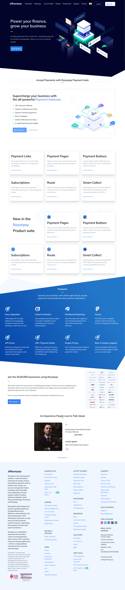

# Clone the repository
git clone https://github.com/yourusername/RazorPay-Clone.git

# Navigate to the project directory
cd RazorPay-Clone

# Install dependencies
npm install

# Start the development server
npm run dev

#ScreenShot

